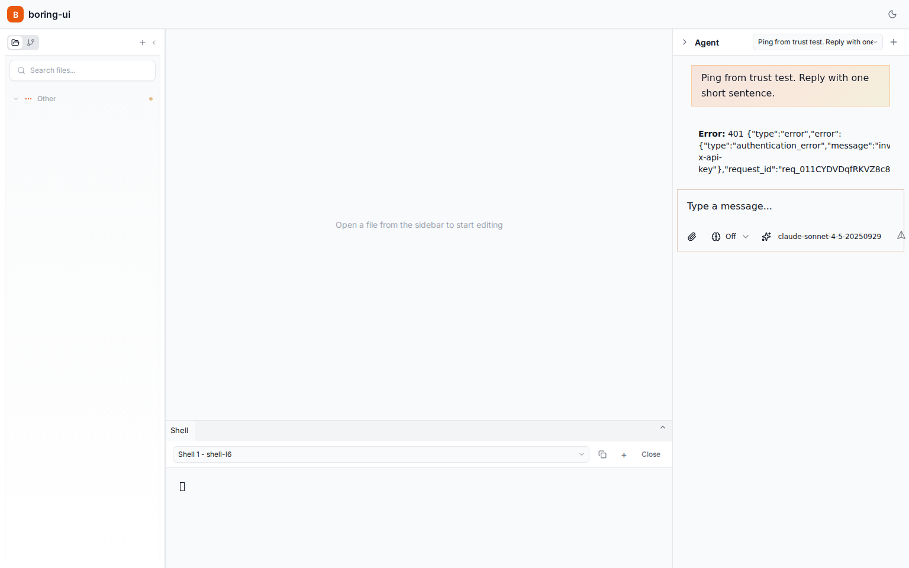
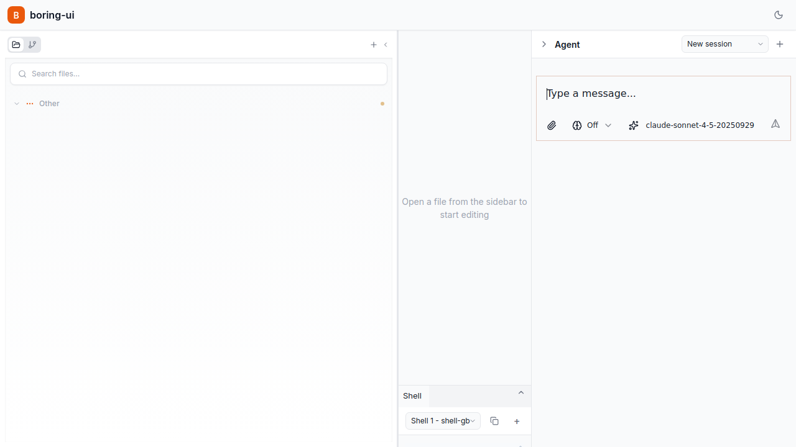

# bd-1dsu: PI mode reactivity trust test (verified)

*2026-02-17T10:30:55Z by Showboat 0.5.0*

Thresholds:
- TTFT <= 2000ms
- Total response <= 12000ms
- No stream hang (provider request in-flight > 25000ms)

Targets:
- Backend: http://0.0.0.0:3456
- Frontend: http://213.32.19.186:5190/?agent_mode=pi

Automation note: probe injects `--provider-key test-key` to force real PI send-path and measure UI reactivity deterministically without secrets.

```bash
python3 - <<'PY'
import json,re,pathlib
reg = pathlib.Path('src/front/providers/pi/registerBuiltins.browser.js').read_text()
providers = re.findall(r"api: '([^']+)'", reg)
api_base = pathlib.Path('src/front/utils/apiBase.js').read_text()
print(json.dumps({
  'registered_pi_apis': providers,
  'api_base_includes_5190': '5190' in re.findall(r"'([0-9]+)'", api_base),
  'loopback_rewrite_enabled': 'rewriteLoopbackForRemoteClient' in api_base,
}, indent=2))
PY
```

```output
{
  "registered_pi_apis": [
    "anthropic-messages",
    "google-generative-ai",
    "openai-completions",
    "openai-responses"
  ],
  "api_base_includes_5190": true,
  "loopback_rewrite_enabled": true
}
```

```bash
bash scripts/pi_backend_smoke.sh 'http://0.0.0.0:3456'
```

```output
{
  "backend_url": "http://0.0.0.0:3456",
  "health_status_code": 200,
  "health_status": "ok",
  "capabilities_status_code": 200,
  "features_subset": {
    "files": true,
    "pty": true,
    "companion": true,
    "pi": true
  },
  "services": {},
  "notes": [
    "PI mode in this branch is embedded in frontend; no dedicated local /api/pi or /ws/pi endpoint exists.",
    "Model streaming is handled by pi-ai providers directly from browser context."
  ]
}
```

```bash
nodejs scripts/pi_reactivity_trust_test.mjs --frontend 'http://213.32.19.186:5190/?agent_mode=pi' --backend 'http://0.0.0.0:3456' --provider-key 'test-key' --wait-panel-ms 12000 --ttft-max-ms 2000 --total-max-ms 12000 --hang-max-ms 25000 --out '.evidence/bd-1dsu-pi-reactivity-fixed.json' --screenshot '.evidence/bd-1dsu-pi-reactivity-ui-fixed.png' >/tmp/bd1dsu_probe_v3.log
python3 - <<'PY'
import json
j=json.load(open('.evidence/bd-1dsu-pi-reactivity-fixed.json'))
ttft=j.get('ui_probe',{}).get('firstVisibleUpdateMs')
total=j.get('ui_probe',{}).get('totalResponseMs')
provider_codes=sorted({d.get('status') for d in j.get('network_summary',{}).get('provider_request_details',[]) if d.get('category')=='anthropic'})
summary={
  'pass': bool(j.get('pass')),
  'backend_pi_feature': j.get('backend',{}).get('capabilities',{}).get('json',{}).get('features',{}).get('pi') is True,
  'ui_probe_ok': j.get('ui_probe',{}).get('ok') is True,
  'ttft_within_threshold': isinstance(ttft,(int,float)) and ttft <= 2000,
  'total_within_threshold': isinstance(total,(int,float)) and total <= 12000,
  'mutation_observed': (j.get('ui_probe',{}).get('mutationCount') or 0) > 0,
  'stream_hang_detected': bool(j.get('network_summary',{}).get('stream_hang_detected')),
  'anthropic_status_codes': provider_codes,
}
print(json.dumps(summary, indent=2))
PY
```

```output
{
  "pass": true,
  "backend_pi_feature": true,
  "ui_probe_ok": true,
  "ttft_within_threshold": true,
  "total_within_threshold": true,
  "mutation_observed": true,
  "stream_hang_detected": false,
  "anthropic_status_codes": [
    401
  ]
}
```

```bash
rodney open 'http://213.32.19.186:5190/?agent_mode=pi' >/tmp/bd1dsu_rodney_open_v3.log && rodney waitidle >/tmp/bd1dsu_rodney_wait_v3.log && rodney screenshot .evidence/bd-1dsu-pi-reactivity-rodney-fixed.png
```

```output
.evidence/bd-1dsu-pi-reactivity-rodney-fixed.png
```

```bash {image}
.evidence/bd-1dsu-pi-reactivity-ui-fixed.png
```



```bash {image}
.evidence/bd-1dsu-pi-reactivity-rodney-fixed.png
```



```bash
nodejs ./node_modules/vitest/vitest.mjs run src/front/utils/apiBase.test.js src/front/providers/companion/config.test.js >/tmp/bd1dsu_vitest_v3.log
python3 - <<'PY'
import re, json
text=open('/tmp/bd1dsu_vitest_v3.log').read()
print(json.dumps({
  'test_files_2_passed': bool(re.search(r'Test Files\s+2 passed', text)),
  'tests_5_passed': bool(re.search(r'Tests\s+5 passed', text)),
}, indent=2))
PY
```

```output
{
  "test_files_2_passed": true,
  "tests_5_passed": true
}
```
