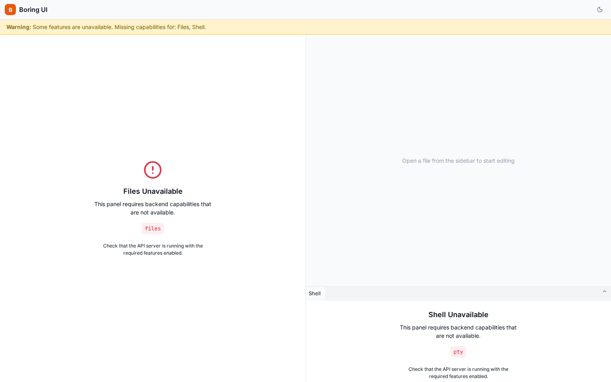
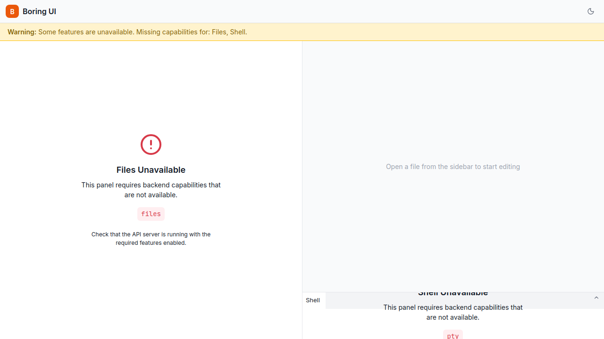

# bd-1dsu: PI mode reactivity trust test

*2026-02-17T10:04:32Z by Showboat 0.5.0*

PASS/FAIL thresholds (introverted trust test):
- TTFT (time-to-first-visible-update) <= 2000 ms
- Total response/settle time <= 12000 ms
- Stream hang if no terminal state by 30000 ms or provider request in-flight > 25000 ms

Target URLs:
- Backend: http://0.0.0.0:3456
- Frontend: http://213.32.19.186:5190/?agent_mode=pi

```bash
python3 - <<'PY'
import json,re,pathlib
reg = pathlib.Path('src/front/providers/pi/registerBuiltins.browser.js').read_text()
providers = re.findall(r"api: '([^']+)'", reg)
api_base = pathlib.Path('src/front/utils/apiBase.js').read_text()
dev_ports = re.findall(r"'([0-9]+)'", api_base)
models = pathlib.Path('node_modules/@mariozechner/pi-ai/dist/models.generated.js').read_text()
urls = sorted(set(re.findall(r'baseUrl: "(https://[^"]+)"', models)))
interesting = [u for u in urls if ('anthropic' in u or 'openai' in u or 'google' in u)]
print(json.dumps({
  'pi_frontend_registered_apis': providers,
  'api_base_dev_ports': dev_ports,
  'api_base_includes_5190': '5190' in dev_ports,
  'provider_base_urls_sample': interesting[:8],
  'notes': [
    'PI mode uses browser-side providers from pi-ai; no dedicated /api/pi or /ws/pi backend route in this codepath.',
    'Embedded PI panel relies on frontend API base resolution + direct provider streaming.'
  ]
}, indent=2))
PY

```

```output
{
  "pi_frontend_registered_apis": [
    "anthropic-messages",
    "google-generative-ai",
    "openai-completions",
    "openai-responses"
  ],
  "api_base_dev_ports": [
    "3000",
    "3001",
    "4173",
    "4174",
    "5173",
    "5174",
    "5175",
    "5176",
    "5180"
  ],
  "api_base_includes_5190": false,
  "provider_base_urls_sample": [
    "https://api.anthropic.com",
    "https://api.groq.com/openai/v1",
    "https://api.minimax.io/anthropic",
    "https://api.minimaxi.com/anthropic",
    "https://api.openai.com/v1",
    "https://cloudcode-pa.googleapis.com",
    "https://daily-cloudcode-pa.sandbox.googleapis.com",
    "https://generativelanguage.googleapis.com/v1beta"
  ],
  "notes": [
    "PI mode uses browser-side providers from pi-ai; no dedicated /api/pi or /ws/pi backend route in this codepath.",
    "Embedded PI panel relies on frontend API base resolution + direct provider streaming."
  ]
}
```

```bash
scripts/pi_backend_smoke.sh 'http://0.0.0.0:3456'
```

```output
{
  "backend_url": "http://0.0.0.0:3456",
  "health_status_code": 200,
  "health_status": "ok",
  "capabilities_status_code": 200,
  "features_subset": {
    "files": true,
    "pty": true,
    "companion": true,
    "pi": true
  },
  "services": {},
  "notes": [
    "PI mode in this branch is embedded in frontend; no dedicated local /api/pi or /ws/pi endpoint exists.",
    "Model streaming is handled by pi-ai providers directly from browser context."
  ]
}
```

```bash
node scripts/pi_reactivity_trust_test.mjs \
  --frontend 'http://213.32.19.186:5190/?agent_mode=pi' \
  --backend 'http://0.0.0.0:3456' \
  --wait-panel-ms 8000 \
  --out '.evidence/bd-1dsu-pi-reactivity.json' \
  --screenshot '.evidence/bd-1dsu-pi-reactivity-ui.png' >/tmp/bd1dsu_probe.log
python3 - <<'PY'
import json,re
j=json.load(open('.evidence/bd-1dsu-pi-reactivity.json'))
err=j.get('ui_probe',{}).get('error','')
m=re.search(r'Timeout\s+(\d+)ms',err)
first_failed = next((x for x in (j.get('network_summary',{}).get('api_request_details') or []) if x.get('failed')), {})
summary={
  'pass': j.get('pass'),
  'failures': j.get('failures'),
  'ui_probe_ok': j.get('ui_probe',{}).get('ok'),
  'ttft_ms': j.get('ui_probe',{}).get('firstVisibleUpdateMs'),
  'total_response_ms': j.get('ui_probe',{}).get('totalResponseMs'),
  'done_reason': j.get('ui_probe',{}).get('doneReason'),
  'ui_timeout_ms': int(m.group(1)) if m else None,
  'backend_pi_feature': j.get('backend',{}).get('capabilities',{}).get('json',{}).get('features',{}).get('pi'),
  'first_failed_api_url': first_failed.get('url'),
  'first_failed_api_error': first_failed.get('failed'),
}
print(json.dumps(summary, indent=2))
PY

```

```output
{
  "pass": false,
  "failures": [
    "ui_probe_failed: forFunction: Timeout 8000ms exceeded."
  ],
  "ui_probe_ok": false,
  "ttft_ms": null,
  "total_response_ms": null,
  "done_reason": null,
  "ui_timeout_ms": 8000,
  "backend_pi_feature": true,
  "first_failed_api_url": "http://127.0.0.1:3456/api/capabilities",
  "first_failed_api_error": "net::ERR_FAILED"
}
```

```bash
rodney open 'http://213.32.19.186:5190/?agent_mode=pi' >/tmp/bd1dsu_rodney_open.log && rodney waitidle >/tmp/bd1dsu_rodney_wait.log && rodney screenshot .evidence/bd-1dsu-pi-reactivity-rodney.png
```

```output
.evidence/bd-1dsu-pi-reactivity-rodney.png
```

```bash {image}
.evidence/bd-1dsu-pi-reactivity-ui.png
```



```bash {image}
.evidence/bd-1dsu-pi-reactivity-rodney.png
```


