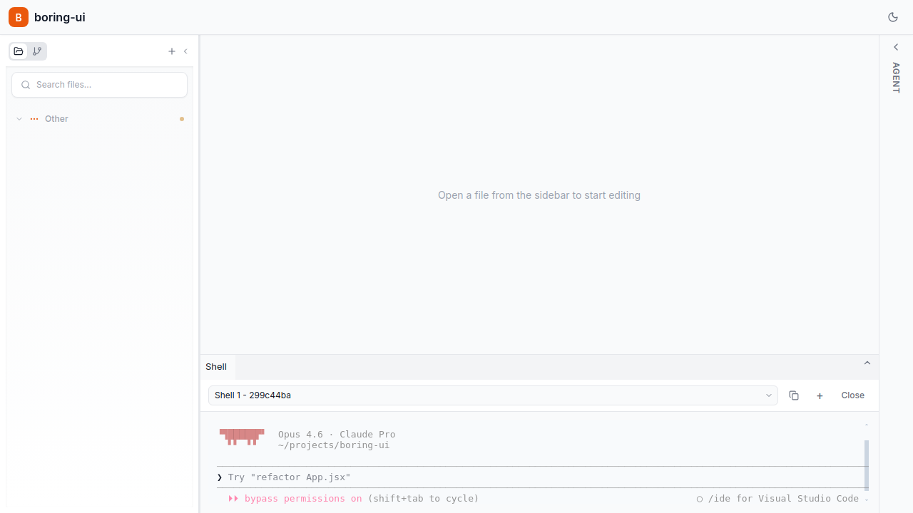

# bd-3o2f: Fix companion right-rail layout + collapse

*2026-02-16T19:45:49Z by Showboat 0.5.0*

Companion now uses right-rail anchoring parity with Agent Chat, and native mode websocket base resolves to backend port 8000 for dev ports including 5180.

```bash
nodejs .evidence/bd3o2f-check.cjs
```

```output
{
  "results": [
    {
      "mode": "native",
      "terminalCount": 1,
      "companionCount": 0,
      "reachesBottom": true
    },
    {
      "mode": "companion",
      "terminalCount": 0,
      "companionCount": 1,
      "reachesBottom": true
    },
    {
      "mode": "both",
      "terminalCount": 1,
      "companionCount": 1,
      "reachesBottom": true
    }
  ],
  "wsCheck": {
    "wsBase": "ws://127.0.0.1:8000",
    "pty": {
      "url": "ws://127.0.0.1:8000/ws/pty?provider=shell",
      "status": "open"
    },
    "stream": {
      "url": "ws://127.0.0.1:8000/ws/claude-stream?mode=ask",
      "status": "open"
    }
  }
}
```

```bash
npm run build 2>&1 | sed -E 's/index-[A-Za-z0-9_-]+\.(css|js)/index-<hash>.\1/g; s/[0-9][0-9,]*\.[0-9]{2} kB/<size> kB/g; s/built in [0-9.]+s/built in <time>/; s/[0-9]+ modules transformed\./<modules> modules transformed./'
```

```output

> boring-ui@0.1.0 build
> vite build

vite v5.4.21 building for production...
transforming...
✓ <modules> modules transformed.
rendering chunks...
computing gzip size...
dist/index.html                     <size> kB │ gzip:   <size> kB
dist/assets/index-<hash>.css    <size> kB │ gzip:  <size> kB
dist/assets/index-<hash>.js   <size> kB │ gzip: <size> kB

(!) Some chunks are larger than 500 kB after minification. Consider:
- Using dynamic import() to code-split the application
- Use build.rollupOptions.output.manualChunks to improve chunking: https://rollupjs.org/configuration-options/#output-manualchunks
- Adjust chunk size limit for this warning via build.chunkSizeWarningLimit.
✓ built in <time>
```

```bash {image}

```


```bash {image}

```


