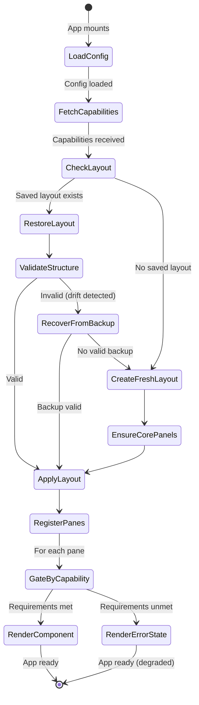
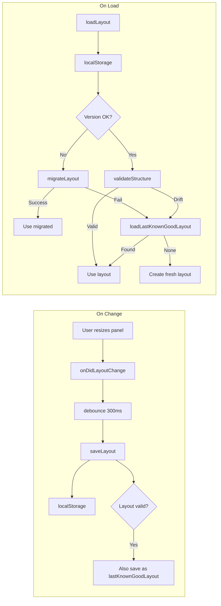
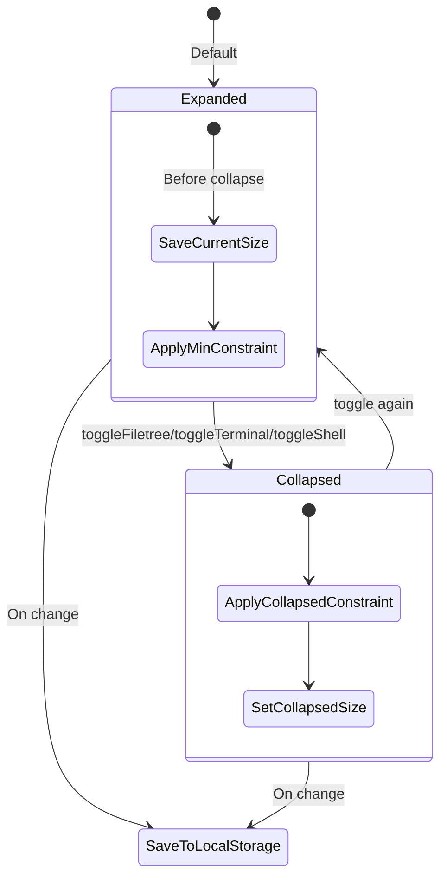

# boring-ui

A composable, capability-gated UI framework for building IDE-like applications. boring-ui separates concerns into independently configurable layers that gracefully degrade when backend features are unavailable.

## Architecture Overview

```
┌─────────────────────────────────────────────────────────────────────────────┐
│                              boring-ui                                       │
├─────────────────────────────────────────────────────────────────────────────┤
│  Frontend (React + Dockview)                                                │
│  ┌──────────────┐  ┌──────────────┐  ┌──────────────┐  ┌──────────────┐   │
│  │ Pane Registry│──│CapabilityGate│──│LayoutManager│──│  ConfigProvider│   │
│  │              │  │              │  │              │  │              │   │
│  │ Declares     │  │ Checks API   │  │ Persists     │  │ Merges user  │   │
│  │ requirements │  │ capabilities │  │ layout state │  │ + defaults   │   │
│  └──────────────┘  └──────────────┘  └──────────────┘  └──────────────┘   │
├─────────────────────────────────────────────────────────────────────────────┤
│  Backend (FastAPI)                                                          │
│  ┌──────────────┐  ┌──────────────┐  ┌──────────────┐  ┌──────────────┐   │
│  │RouterRegistry│──│  Capabilities│──│   Modular    │──│   Storage    │   │
│  │              │  │   Endpoint   │  │   Routers    │  │   Backends   │   │
│  │ files, git,  │  │ /api/        │  │ files, git,  │  │ LocalStorage │   │
│  │ pty, stream  │  │ capabilities │  │ pty, stream  │  │ (pluggable)  │   │
│  └──────────────┘  └──────────────┘  └──────────────┘  └──────────────┘   │
└─────────────────────────────────────────────────────────────────────────────┘
```

## Key Concepts

### Capability-Gated Components

Panels declare their backend requirements. The system automatically shows error states when capabilities are missing—no crashes, no manual feature flags.

```javascript
// Pane declares what it needs
registry.register({
  id: 'shell',
  component: ShellTerminalPanel,
  requiresRouters: ['pty'],  // Needs PTY WebSocket
})

// Backend advertises what's available
GET /api/capabilities → { features: { pty: true, files: true, ... } }

// CapabilityGate wraps panes and renders error state if requirements unmet
```

### Composable Backend

The backend uses a router registry pattern. Enable only what you need:

```python
# Full-featured app
app = create_app()

# Minimal app (no WebSockets)
app = create_app(routers=['files', 'git'])

# Custom selection
app = create_app(routers=['files', 'git', 'approval'])
```

### Config-Driven UI

All behavior is configurable via `app.config.js`. Defaults match a working app, so config is optional.

```javascript
export default {
  branding: { name: 'My IDE', logo: 'M' },
  storage: { prefix: 'myide' },
  panels: { defaults: { filetree: 300 } },
  styles: { light: { accent: '#8b5cf6' } },
}
```

## Project Structure

```
boring-ui/
├── src/
│   ├── front/                    # React frontend
│   │   ├── App.jsx               # Main app shell with Dockview
│   │   ├── registry/
│   │   │   └── panes.js          # Pane registry (component → requirements)
│   │   ├── components/
│   │   │   ├── CapabilityGate.jsx # Wraps panes with capability checks
│   │   │   ├── FileTree.jsx      # File browser with git status
│   │   │   ├── Editor.jsx        # TipTap-based markdown editor
│   │   │   ├── Terminal.jsx      # xterm.js terminal
│   │   │   └── chat/             # Claude chat interface
│   │   ├── panels/               # Dockview panel wrappers
│   │   │   ├── FileTreePanel.jsx
│   │   │   ├── EditorPanel.jsx
│   │   │   ├── TerminalPanel.jsx # Claude sessions panel
│   │   │   └── ShellTerminalPanel.jsx
│   │   ├── hooks/
│   │   │   ├── useCapabilities.js # Fetches /api/capabilities
│   │   │   ├── useTheme.jsx      # Theme management
│   │   │   └── useKeyboardShortcuts.js
│   │   ├── layout/
│   │   │   └── LayoutManager.js  # Layout persistence/migration
│   │   └── config/
│   │       ├── appConfig.js      # Config loading/merging
│   │       └── ConfigProvider.jsx
│   │
│   └── back/                     # Python backend
│       └── boring_ui/
│           └── api/
│               ├── app.py        # create_app() factory
│               ├── capabilities.py # RouterRegistry + /api/capabilities
│               ├── config.py     # APIConfig dataclass
│               ├── storage.py    # Storage interface
│               └── modules/
│                   ├── files/    # File CRUD operations
│                   ├── git/      # Git status/diff/show
│                   ├── pty/      # Shell PTY WebSocket
│                   └── stream/   # Claude chat WebSocket
├── app.config.js                 # Your app configuration
└── vite.config.ts
```

## State Diagrams

### Application Initialization



### Capability Gating Flow

```mermaid
flowchart TD
    subgraph Backend
        A[RouterRegistry] -->|registers| B[files, git, pty, stream]
        B -->|enabled set| C[/api/capabilities]
    end

    subgraph Frontend
        D[useCapabilities hook] -->|fetches| C
        D -->|provides| E[CapabilitiesContext]

        F[PaneRegistry] -->|declares| G[requiresFeatures/requiresRouters]

        H[CapabilityGate] -->|reads| E
        H -->|checks| G
        H -->|renders| I{Requirements met?}
        I -->|Yes| J[Actual Component]
        I -->|No| K[PaneErrorState]
    end
```

### Layout Persistence



### Panel Collapse State



## Composability Model

### Frontend: Pane Registry

The pane registry (`src/front/registry/panes.js`) decouples panel components from capability checking:

```javascript
// Register a pane with its requirements
registry.register({
  id: 'terminal',
  component: TerminalPanel,
  title: 'Code Sessions',
  placement: 'right',
  essential: true,
  locked: true,
  requiresRouters: ['chat_claude_code'],
})

// App.jsx uses gated components
const components = getGatedComponents(createCapabilityGatedPane)
// → Components automatically wrapped with capability checks
```

**Available Panes:**

| Pane ID   | Essential | Requirements          | Description              |
|-----------|-----------|------------------------|--------------------------|
| filetree  | Yes       | `files` feature        | File browser + git status|
| editor    | No        | `files` feature        | TipTap markdown editor   |
| terminal  | Yes       | `chat_claude_code`     | Claude chat sessions     |
| shell     | Yes       | `pty` router           | Shell terminal           |
| review    | No        | `approval` router      | Tool approval panel      |
| empty     | No        | None                   | Placeholder              |

### Backend: Router Registry

The router registry (`src/back/boring_ui/api/capabilities.py`) allows selective feature composition:

```python
# Default registry includes all routers
registry = create_default_registry()

# Routers are mounted based on enabled set
app = create_app(routers=['files', 'git', 'pty'])
# → Only file, git, and PTY routes available
# → /api/capabilities reflects actual availability
```

**Available Routers:**

| Router           | Prefix   | Description                    |
|------------------|----------|--------------------------------|
| files            | /api/v1/files | File CRUD + directory listing/search |
| git              | /api/v1/git   | Status, diff, show                  |
| pty              | /ws/pty  | Shell terminal WebSocket       |
| chat_claude_code | /ws/claude-stream | Claude stream WebSocket |
| approval         | /api     | Tool approval workflow         |

### Config: Deep Merge with Defaults

Configuration (`src/front/config/appConfig.js`) uses deep merge—provide only what you want to change:

```javascript
// Your app.config.js - only override what you need
export default {
  branding: { name: 'My App' },  // logo, titleFormat use defaults
  storage: { prefix: 'myapp' },
}

// Result after merge:
{
  branding: {
    name: 'My App',           // Your override
    logo: 'B',                // Default
    titleFormat: (ctx) => ... // Default
  },
  storage: {
    prefix: 'myapp',          // Your override
    layoutVersion: 1,         // Default
  },
  // ... all other defaults preserved
}
```

## Quick Start

### Installation

```bash
# Clone and install
git clone <repo> boring-ui
cd boring-ui
npm install

# Start frontend dev server
npm run dev

# In another terminal, start backend
cd src/back
pip install -e .
python -m boring_ui.api
```

### Minimal Configuration

Create `app.config.js` in your project root:

```javascript
export default {
  branding: {
    name: 'My IDE',
    logo: 'M',
  },
  storage: {
    prefix: 'myide',
  },
}
```

### Running

```bash
npm run dev        # Development server at localhost:5173
npm run build      # Production build
npm run preview    # Preview production build
```

## API Reference

### Backend Endpoints

| Endpoint              | Method | Description                      |
|-----------------------|--------|----------------------------------|
| /api/capabilities     | GET    | Available features and routers   |
| /api/config           | GET    | Workspace configuration          |
| /api/project          | GET    | Project root path                |
| /api/v1/files/list    | GET    | List directory entries           |
| /api/v1/files/read    | GET    | Read file content                |
| /api/v1/files/write   | PUT    | Write file content               |
| /api/v1/files/delete  | DELETE | Delete file                      |
| /api/v1/files/rename  | POST   | Rename file                      |
| /api/v1/files/move    | POST   | Move file                        |
| /api/v1/files/search  | GET    | Search files                     |
| /api/v1/git/status    | GET    | Git status                       |
| /api/v1/git/diff      | GET    | Git diff                         |
| /api/v1/git/show      | GET    | Git show                         |
| /ws/pty               | WS     | Shell PTY (query params include `session_id`, `provider`) |
| /ws/claude-stream     | WS     | Claude chat stream               |

### Frontend Hooks

```javascript
import { useCapabilities, useTheme, useKeyboardShortcuts } from './hooks'

// Check backend capabilities
const { capabilities, loading } = useCapabilities()

// Theme management
const { theme, setTheme } = useTheme()

// Keyboard shortcuts
useKeyboardShortcuts({ toggleFiletree, toggleTerminal, toggleShell })
```

## Testing

```bash
npm test              # Unit tests (watch mode)
npm run test:run      # Single run
npm run test:coverage # With coverage
```

## License

MIT
