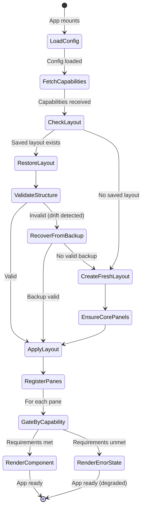
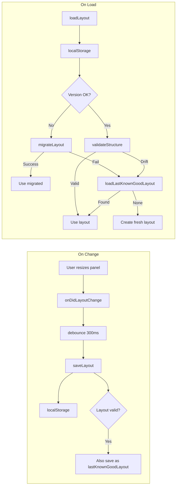
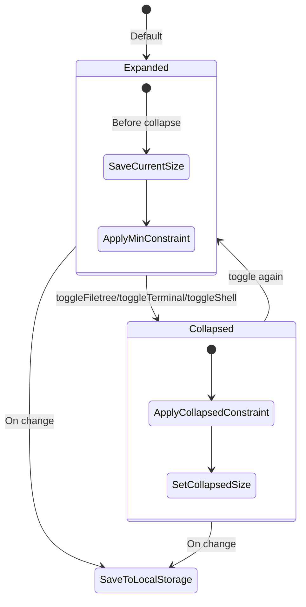

# boring-ui

A composable, capability-gated UI framework for building IDE-like applications. boring-ui separates concerns into independently configurable layers that gracefully degrade when backend features are unavailable.

## Architecture Overview

```
┌─────────────────────────────────────────────────────────────────────────────┐
│                              boring-ui                                       │
├─────────────────────────────────────────────────────────────────────────────┤
│  Frontend (React + Dockview)                                                │
│  ┌──────────────┐  ┌──────────────┐  ┌──────────────┐  ┌──────────────┐   │
│  │ Pane Registry│──│CapabilityGate│──│LayoutManager│──│  ConfigProvider│   │
│  │              │  │              │  │              │  │              │   │
│  │ Declares     │  │ Checks API   │  │ Persists     │  │ Merges user  │   │
│  │ requirements │  │ capabilities │  │ layout state │  │ + defaults   │   │
│  └──────────────┘  └──────────────┘  └──────────────┘  └──────────────┘   │
├─────────────────────────────────────────────────────────────────────────────┤
│  Backend (Fastify + tRPC)                                                  │
│  ┌──────────────┐  ┌──────────────┐  ┌──────────────┐  ┌──────────────┐   │
│  │ HTTP Routes  │──│  Capabilities│──│   Domain     │──│  Workspace   │   │
│  │              │  │   Endpoint   │  │   Services   │  │   Backends   │   │
│  │ files, git,  │  │ /api/        │  │ files, git,  │  │ bwrap,       │   │
│  │ exec, auth   │  │ capabilities │  │ exec, auth   │  │ lightningfs  │   │
│  └──────────────┘  └──────────────┘  └──────────────┘  └──────────────┘   │
└─────────────────────────────────────────────────────────────────────────────┘
```

## Key Concepts

### Capability-Gated Components

Panels declare their backend requirements. The system automatically shows error states when capabilities are missing—no crashes, no manual feature flags.

```javascript
// Pane declares what it needs
registry.register({
  id: 'shell',
  component: ShellTerminalPanel,
  requiresRouters: ['pty'],  // Needs PTY WebSocket
})

// Backend advertises what's available
GET /api/capabilities → { features: { pty: true, files: true, ... } }

// CapabilityGate wraps panes and renders error state if requirements unmet
```

### Composable Backend

The backend uses a router registry pattern. Enable only what you need:

```python
# Full-featured app
app = create_app()

# Minimal app (no WebSockets)
app = create_app(routers=['files', 'git'])

# Custom selection
app = create_app(routers=['files', 'git', 'approval'])
```

### Runtime Config

Frontend boot now reads runtime config from `GET /__bui/config`, backed by `boring.app.toml`.

```toml
[app]
name = "My IDE"
logo = "M"
id = "my-ide"

[frontend.branding]
name = "My IDE"

[frontend.data]
backend = "lightningfs"

[frontend.panels]
```

For quick standalone backend testing without editing config:
- `?data_backend=http`
- `?data_backend=lightningfs`
- `?data_backend=lightningfs&data_fs=myide-fs-alt`

### Root Package CSS Contract

Phase 1 styling contract (current package shape):

- public CSS entrypoint remains `boring-ui/style.css`
- Phase 1 exposes only one public CSS subpath export (`./style.css`)
- host app imports shared UI CSS once at startup
- `src/front/styles/tokens.css` is the canonical token + theme bridge (`:root` + `[data-theme="dark"]`)
- root stylesheet import order is locked (`tokens.css` before `scrollbars.css`)
- baseline resets/preflight ownership stay in root package CSS (not Tailwind base directives)
- runtime panels are expected to rely on host-loaded shared UI CSS instead of self-importing arbitrary CSS

Reference: `docs/runbooks/CSS_CONTRACT.md`

### Root Package Entrypoints

Phase 1 keeps the root-package shape and stable import paths:

- ESM entrypoint: `./dist/boring-ui.js`
- CJS entrypoint: `./dist/boring-ui.cjs`
- CSS entrypoint: `./dist/style.css` (consumed as `boring-ui/style.css`)

Public API boundaries are defined in `src/front/index.js` and validated via:

- unit contract test: `npm run test:run -- src/front/__tests__/rootEntrypointContract.test.js`
- build+resolution smoke: `npm run smoke:entrypoints`

Reference: `docs/runbooks/ROOT_PACKAGE_ENTRYPOINTS.md`

### Shared Style Runtime Contract

Phase 1 runtime-facing assumptions are intentionally minimal and docs-level:

- runtime/child panels rely on host-loaded shared UI CSS
- theme state flows through document-root `data-theme`
- token bridge remains host-owned and shared, not redefined per runtime panel
- compiler policy and runtime CSS allowlists are explicitly deferred to later phases

Reference: `docs/runbooks/SHARED_STYLE_RUNTIME_CONTRACT.md`

### Core/Edge Modes and UI Profiles

Canonical contract:
- Deploy mode: `core` or `edge`
- UI profile: `pi-lightningfs`, `pi-cheerpx`, `pi-httpfs`, `companion-httpfs`

Recommended defaults:
- `core` -> `pi-lightningfs`
- `edge` -> `companion-httpfs`

Profile matrix:

| UI Profile | Agent rail | Data backend |
| --- | --- | --- |
| `pi-lightningfs` | `pi` | `lightningfs` |
| `pi-cheerpx` | `pi` | `cheerpx` |
| `pi-httpfs` | `pi` | `http` |
| `companion-httpfs` | `companion` | `http` |

Environment contract:

```bash
VITE_DEPLOY_MODE=core|edge
VITE_UI_PROFILE=pi-lightningfs|pi-cheerpx|pi-httpfs|companion-httpfs
```

Reference: `docs/runbooks/MODES_AND_PROFILES.md`

### PI Tool Extensions (Vertical Apps)

Vertical apps (for example `boring-macro`) can register PI tools at startup:

```javascript
import { addPiAgentTools } from 'boring-ui'

addPiAgentTools([
  {
    name: 'macro_run',
    label: 'Run Macro',
    description: 'Execute a boring-macro pipeline by id.',
    parameters: Type.Object({
      macro_id: Type.String(),
    }),
    execute: async (_callId, params) => {
      const result = await fetch('/api/v1/macro/run', {
        method: 'POST',
        headers: { 'content-type': 'application/json' },
        body: JSON.stringify({ macro_id: params.macro_id }),
      }).then((r) => r.json())
      return {
        content: [{ type: 'text', text: `Triggered macro ${params.macro_id}` }],
        details: result,
      }
    },
  },
])
```

Notes:
- Tool names are merged by `name` (later registrations override earlier ones).
- Built-in PI filesystem/git/UI tools remain available unless overridden by name.

## Project Structure

```
boring-ui/
├── src/
│   ├── front/                    # React frontend
│   │   ├── App.jsx               # Main app shell with Dockview
│   │   ├── registry/
│   │   │   └── panes.js          # Pane registry (component → requirements)
│   │   ├── components/
│   │   │   ├── CapabilityGate.jsx # Wraps panes with capability checks
│   │   │   ├── FileTree.jsx      # File browser with git status
│   │   │   ├── Editor.jsx        # TipTap-based markdown editor
│   │   │   ├── Terminal.jsx      # xterm.js terminal
│   │   │   └── chat/             # Claude chat interface
│   │   ├── panels/               # Dockview panel wrappers
│   │   │   ├── FileTreePanel.jsx
│   │   │   ├── EditorPanel.jsx
│   │   │   ├── TerminalPanel.jsx # Claude sessions panel
│   │   │   └── ShellTerminalPanel.jsx
│   │   ├── hooks/
│   │   │   ├── useCapabilities.js # Fetches /api/capabilities
│   │   │   ├── useTheme.jsx      # Theme management
│   │   │   └── useKeyboardShortcuts.js
│   │   ├── layout/
│   │   │   └── LayoutManager.js  # Layout persistence/migration
│   │   └── config/
│   │       ├── appConfig.js      # Config loading/merging
│   │       └── ConfigProvider.jsx
│   │
│   └── server/                   # TypeScript backend (Fastify + tRPC)
│       ├── app.ts                # createApp() factory
│       ├── config.ts             # Zod-validated ServerConfig
│       ├── index.ts              # Server entry point
│       ├── http/                 # HTTP route handlers
│       │   ├── authRoutes.ts     # Auth (session, callback, token exchange)
│       │   ├── fileRoutes.ts     # File CRUD operations
│       │   ├── gitRoutes.ts      # Git status/diff/show
│       │   └── execRoutes.ts     # Exec (bash/python via bwrap)
│       ├── services/             # Domain services
│       ├── auth/                 # Session JWT, middleware
│       └── workspace/            # Resolver, membership, boundary
├── boring.app.toml              # Runtime app + frontend configuration
└── vite.config.ts
```

## State Diagrams

### Application Initialization


```mermaid
stateDiagram-v2
    [*] --> LoadConfig: App mounts
    LoadConfig --> FetchCapabilities: Config loaded
    FetchCapabilities --> CheckLayout: Capabilities received

    CheckLayout --> RestoreLayout: Saved layout exists
    CheckLayout --> CreateFreshLayout: No saved layout

    RestoreLayout --> ValidateStructure
    ValidateStructure --> ApplyLayout: Valid
    ValidateStructure --> RecoverFromBackup: Invalid (drift detected)
    RecoverFromBackup --> ApplyLayout: Backup valid
    RecoverFromBackup --> CreateFreshLayout: No valid backup

    CreateFreshLayout --> EnsureCorePanels
    EnsureCorePanels --> ApplyLayout

    ApplyLayout --> RegisterPanes
    RegisterPanes --> GateByCapability: For each pane
    GateByCapability --> RenderComponent: Requirements met
    GateByCapability --> RenderErrorState: Requirements unmet

    RenderComponent --> [*]: App ready
    RenderErrorState --> [*]: App ready (degraded)
```

### Capability Gating Flow

```mermaid
flowchart TD
    subgraph Backend
        A[RouterRegistry] -->|registers| B[files, git, pty, stream]
        B -->|enabled set| C[/api/capabilities]
    end

    subgraph Frontend
        D[useCapabilities hook] -->|fetches| C
        D -->|provides| E[CapabilitiesContext]

        F[PaneRegistry] -->|declares| G[requiresFeatures/requiresRouters]

        H[CapabilityGate] -->|reads| E
        H -->|checks| G
        H -->|renders| I{Requirements met?}
        I -->|Yes| J[Actual Component]
        I -->|No| K[PaneErrorState]
    end
```

### Layout Persistence


```mermaid
flowchart LR
    subgraph "On Change"
        A[User resizes panel] --> B[onDidLayoutChange]
        B --> C[debounce 300ms]
        C --> D[saveLayout]
        D --> E[localStorage]
        D --> F{Layout valid?}
        F -->|Yes| G[Also save as lastKnownGoodLayout]
    end

    subgraph "On Load"
        H[loadLayout] --> I[localStorage]
        I --> J{Version OK?}
        J -->|No| K[migrateLayout]
        K -->|Success| L[Use migrated]
        K -->|Fail| M[loadLastKnownGoodLayout]
        J -->|Yes| N[validateStructure]
        N -->|Valid| O[Use layout]
        N -->|Drift| M
        M -->|Found| O
        M -->|None| P[Create fresh layout]
    end
```

### Panel Collapse State


```mermaid
stateDiagram-v2
    [*] --> Expanded: Default

    Expanded --> Collapsed: toggleFiletree/toggleTerminal/toggleShell
    Collapsed --> Expanded: toggle again

    state Expanded {
        [*] --> SaveCurrentSize: Before collapse
        SaveCurrentSize --> ApplyMinConstraint
    }

    state Collapsed {
        [*] --> ApplyCollapsedConstraint
        ApplyCollapsedConstraint --> SetCollapsedSize
    }

    Expanded --> SaveToLocalStorage: On change
    Collapsed --> SaveToLocalStorage: On change
```

## Composability Model

### Frontend: Pane Registry

The pane registry (`src/front/registry/panes.js`) decouples panel components from capability checking:

```javascript
// Register a pane with its requirements
registry.register({
  id: 'terminal',
  component: TerminalPanel,
  title: 'Code Sessions',
  placement: 'right',
  essential: true,
  locked: true,
  requiresRouters: ['chat_claude_code'],
})

// App.jsx uses gated components
const components = getGatedComponents(createCapabilityGatedPane)
// → Components automatically wrapped with capability checks
```

**Available Panes:**

| Pane ID   | Essential | Requirements          | Description              |
|-----------|-----------|------------------------|--------------------------|
| filetree  | Yes       | `files` feature        | File browser + git status|
| editor    | No        | `files` feature        | TipTap markdown editor   |
| terminal  | Yes       | `chat_claude_code`     | Claude chat sessions     |
| shell     | Yes       | `pty` router           | Shell terminal           |
| review    | No        | `approval` router      | Tool approval panel      |
| empty     | No        | None                   | Placeholder              |

### Backend: Route Modules

The TypeScript backend (`src/server/`) uses Fastify route modules registered in `app.ts`:

**Available Route Modules:**

| Module           | Mount Prefix      | Description                          |
|------------------|-------------------|--------------------------------------|
| fileRoutes       | /api/v1/files     | File CRUD + directory listing/search |
| gitRoutes        | /api/v1/git       | Status, diff, show, commit, push     |
| execRoutes       | /api/v1/exec      | Bash/Python execution via bwrap      |
| authRoutes       | /auth             | Session, callback, token exchange    |
| workspaceRoutes  | /api/v1/workspaces| Workspace lifecycle + membership     |
| githubRoutes     | /api/v1/github    | GitHub App integration               |

### Config: Deep Merge with Defaults

Configuration (`src/front/config/appConfig.js`) uses deep merge—provide only what you want to change:

```javascript
// Your app.config.js - only override what you need
export default {
  branding: { name: 'My App' },  // logo, titleFormat use defaults
  storage: { prefix: 'myapp' },
}

// Result after merge:
{
  branding: {
    name: 'My App',           // Your override
    logo: 'B',                // Default
    titleFormat: (ctx) => ... // Default
  },
  storage: {
    prefix: 'myapp',          // Your override
    layoutVersion: 1,         // Default
  },
  // ... all other defaults preserved
}
```

## Quick Start

### Installation

```bash
# Clone and install
git clone <repo> boring-ui
cd boring-ui
npm install
uv sync
```

### Minimal Configuration

Create `boring.app.toml` in your project root:

```toml
[app]
name = "My IDE"
logo = "M"
id = "my-ide"

[backend]
type = "typescript"
entry = "src/server/index.ts"
routers = []

[frontend.branding]
name = "My IDE"
```

### Running

```bash
# Terminal 1: frontend dev server (Vite HMR)
npm run dev

# Terminal 2: backend API server
npm run server:dev

# Optional production build + preview
npm run build
npm run preview
```

### Shared Packaging Helper (Downstream Apps)

Downstream apps that embed boring-ui can reuse this helper to build frontend assets and stage runtime files:

```bash
python3 scripts/package_app_assets.py \
  --frontend-dir /path/to/app/frontend \
  --static-dir /path/to/app/runtime_static \
  --companion-source /path/to/boring-ui/src/companion_service/launch.sh \
  --companion-target /path/to/app/runtime_companion/launch.sh
```

## What You Build With It

boring-ui is for applications that want the ergonomics of an IDE without
hard-forking an entire editor stack. The framework is a good fit when you need:

- a panel-based workspace shell rather than a single-purpose page
- first-party file, git, auth, and workspace flows under one origin
- a child app that can add domain-specific panels and routes without forking the core
- a deployable hosted app and a locally hackable dev experience using the same config contract
- graceful degradation when some backend capabilities are absent or intentionally disabled

Typical uses include internal tooling, AI-assisted operator consoles, vertical
applications that need a working directory plus custom panels, and domain apps
that want to mix chat, review, file editing, settings, and workflow surfaces in
one shell.

## Current Runtime Path

The primary runtime path today is:

- React + Vite frontend
- Fastify TypeScript backend in `src/server/`
- Neon Auth + Neon Postgres for hosted auth/control-plane state
- `bui` as the framework/child-app orchestration layer

### Child App Contract

The canonical child-app/backend shape is:

```toml
[app]
name = "My App"
logo = "M"
id = "my-app"

[workspace]
backend = "lightningfs"   # local dev default

[agent]
runtime = "pi"
placement = "browser"

[backend]
type = "typescript"
entry = "src/server/index.ts"
port = 8000

[frontend.branding]
name = "My App"
logo = "M"
```

For hosted deploys, the effective runtime contract is typically:

```toml
[workspace]
backend = "bwrap"

[agent]
runtime = "pi"
placement = "browser"
```

That combination yields a browser-side agent rail with server-side filesystem,
git, and exec primitives exposed over HTTP.

## Child App Development Model

Child apps are the main extension mechanism. A child app owns its own
`boring.app.toml`, panels, server entrypoint, deploy metadata, and Vault secret
mapping, while reusing the core framework runtime.

### Default Scaffold

The default scaffold is TypeScript:

```bash
cd /home/ubuntu/projects
bui init <app-name>
cd <app-name>
```

That scaffold gives you:

- `src/server/index.ts` as the child app backend entrypoint
- `src/server/routes/*` for app-specific routes
- `panels/` for custom workspace panels
- a Fly deploy skeleton
- a `boring.app.toml` that pins the app identity and backend contract

Use `bui init --python` only if you explicitly want the legacy Python child-app
loader path.

### Typical Child App Loop

The normal child-app workflow is:

```bash
bui init <app-name>
bui neon setup
bui doctor
bui dev --backend-only
bui deploy
```

Within that loop:

- child routes live in `src/server/index.ts` or `src/server/routes/*`
- child panels live in `panels/`
- child branding, feature flags, panel defaults, secrets, and deploy metadata
  live in `boring.app.toml`
- local Neon-auth parity uses trusted loopback origins such as `127.0.0.1:5176`

The core idea is composition, not inheritance. A child app does not fork the
core app shell; it configures and extends it.

## Hosted Auth, Branding, and Secrets

Hosted auth is same-origin. The browser talks to boring-ui `/auth/*`, and the
server talks to Neon Auth. boring-ui owns the application session cookie and
the post-auth redirect behavior.

### Auth Flow

At a high level:

1. The browser calls `POST /auth/sign-in`, `POST /auth/sign-up`, or related
   same-origin endpoints.
2. The server exchanges those requests with Neon Auth.
3. The server verifies provider tokens via JWKS as needed.
4. The server issues its own `boring_session` cookie.
5. The app redirects into the requested workspace route.

This keeps provider-specific details out of the browser and makes the session
format stable across core app and child apps.

### App-Specific Vault Layout

Hosted secrets are expected to live in app-scoped Vault paths:

```text
secret/agent/app/<app-name>/prod
```

Typical fields include:

- `database_url`
- `session_secret`
- `settings_key`
- `neon_auth_*`
- deploy-specific provider credentials

`bui neon setup` and `bui deploy` use that app-scoped secret layout directly.

### Branding Surfaces

App identity is not just decorative. `boring.app.toml` feeds:

- `/__bui/config`
- hosted auth pages (`/auth/login`, `/auth/signup`, password reset pages)
- frontend branding defaults
- control-plane app identity

That means a child app name/logo can stay consistent across auth, runtime
config, and workspace UI without a separate branding system.

## Runtime Config As A Contract

`GET /__bui/config` is the runtime handshake between the server and the
frontend. It carries:

- app identity (`id`, `name`, `logo`)
- frontend branding
- feature flags
- panel metadata/defaults
- data-backend mapping
- agent/runtime mode information

This endpoint matters because it lets the same frontend bundle boot against
different app identities and workspace backends without a rebuild.

In practice, the server loads `boring.app.toml`, combines it with env-derived
runtime settings, validates the result, and emits a single runtime payload for
the browser.

## Design Principles

### 1. Capability Negotiation Beats Hard Failure

Panels declare the features and routes they need. The backend advertises what
is actually available. The UI renders the real panel or a degraded state based
on that negotiation. This makes feature absence a runtime condition rather than
an app-crashing edge case.

### 2. Fail Closed At Startup

Invalid runtime combinations should crash early. Startup validation is preferred
over “best effort” boot when the app would otherwise come up in a misleading or
unsafe mode.

### 3. Shared Persistence For Hosted Behavior

Anything that must survive deploys, restarts, or multiple Fly machines should
live in shared persistence, not process-local memory. That rule applies to
control-plane state and to child-app features used in hosted evals.

### 4. Composition Over Forking

Child apps extend boring-ui by adding routes, panels, branding, and secrets on
top of the core runtime. The framework stays centrally maintained while domain
apps stay small and specific.

### 5. Same-Origin UX Matters

Auth, workspace navigation, runtime config, and panel boot all happen under the
same origin. That reduces browser auth edge cases and keeps the app shell in
control of redirects, cookies, and branding.

### 6. Prove The Extension Story End To End

The framework is not considered healthy just because the core app boots. It
also needs to prove that a fresh child app can scaffold, add routes/panels,
boot locally, deploy, and behave correctly when hosted.

## Algorithms And Operational Mechanics

### Capability Matching

boring-ui uses a simple but important matching algorithm:

1. Pane registry declares requirements.
2. Backend capabilities endpoint reports actual availability.
3. Capability gate compares requirement sets to capability sets.
4. The shell renders either the real panel or a structured degraded state.

This is more robust than scattering feature flags across individual
components because the contract is explicit at the registry boundary.

### Layout Recovery

The layout manager keeps:

- current layout
- versioned schema metadata
- a last-known-good backup

On load, it validates structure before restoring, attempts migration if the
schema changed, falls back to a backup on drift, and only then creates a fresh
layout. The goal is to make layout persistence self-healing instead of brittle.

### Workspace Backend Resolution

The runtime resolves workspace behavior from `boring.app.toml` and environment:

- `lightningfs` for browser-local development
- `bwrap` for hosted/server-backed workspaces
- `justbash` for experimental in-browser execution

The frontend sees a stable runtime-config view, while the backend enforces the
actual backend semantics.

### Child App Framework Resolution

`bui` resolves the framework in a predictable order:

1. local/sibling framework checkout when present
2. pinned commit/reference from app config
3. cached framework copy when needed

That makes child apps reproducible without submodules while still supporting
fast local iteration against a neighboring framework checkout.

## Evaluation And Proof Strategy

The child-app eval framework in `tests/eval/` exists to prove that the
framework extension model works end to end rather than only in unit tests.

Its lifecycle is:

1. preflight checks
2. agent-driven child-app scaffold/build work
3. clean-room local validation
4. hosted deploy verification
5. scoring
6. evidence bundle generation

The eval lane is intentionally opinionated:

- it expects the TypeScript child-app path
- it checks that hosted behavior does not rely on process-local state
- it validates both local and deployed routes
- it records evidence rather than just returning pass/fail text

That eval discipline is part of the framework design, not a separate QA layer.

## Additional Current Server Surfaces

In addition to the lower-level file/git endpoints listed below, the current
TypeScript server also owns higher-level surfaces such as:

- `/health`, `/healthz`
- `/__bui/config`
- `/auth/*`
- `/api/v1/me`
- `/api/v1/workspaces/*`
- `/api/v1/github/*`
- `/api/v1/ui-state/*`
- workspace boundary routing under `/w/<workspace-id>/...`

These routes are part of the same “IDE shell as a framework” model: not just
editing files, but handling identity, routing, settings, control-plane state,
and extension surfaces in one application contract.

## API Reference

### Backend Endpoints

| Endpoint              | Method | Description                      |
|-----------------------|--------|----------------------------------|
| /api/capabilities     | GET    | Available features and routers   |
| /api/config           | GET    | Workspace configuration          |
| /api/project          | GET    | Project root path                |
| /api/v1/files/list    | GET    | List directory entries           |
| /api/v1/files/read    | GET    | Read file content                |
| /api/v1/files/write   | PUT    | Write file content               |
| /api/v1/files/delete  | DELETE | Delete file                      |
| /api/v1/files/rename  | POST   | Rename file                      |
| /api/v1/files/move    | POST   | Move file                        |
| /api/v1/files/search  | GET    | Search files                     |
| /api/v1/git/status    | GET    | Git status                       |
| /api/v1/git/diff      | GET    | Git diff                         |
| /api/v1/git/show      | GET    | Git show                         |
| /ws/pty               | WS     | Shell PTY (query params include `session_id`, `provider`) |
| /ws/agent/normal/stream | WS   | Claude chat stream               |

### Frontend Hooks

```javascript
import { useCapabilities, useTheme, useKeyboardShortcuts } from './hooks'

// Check backend capabilities
const { capabilities, loading } = useCapabilities()

// Theme management
const { theme, setTheme } = useTheme()

// Keyboard shortcuts
useKeyboardShortcuts({ toggleFiletree, toggleTerminal, toggleShell })
```

## Testing

```bash
npm test              # Unit tests (watch mode)
npm run test:run      # Single run
npm run test:coverage # With coverage
```

## License

MIT
