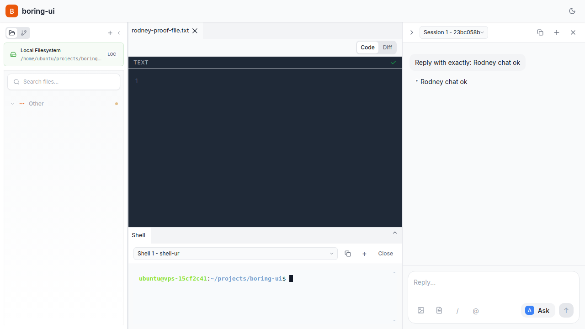
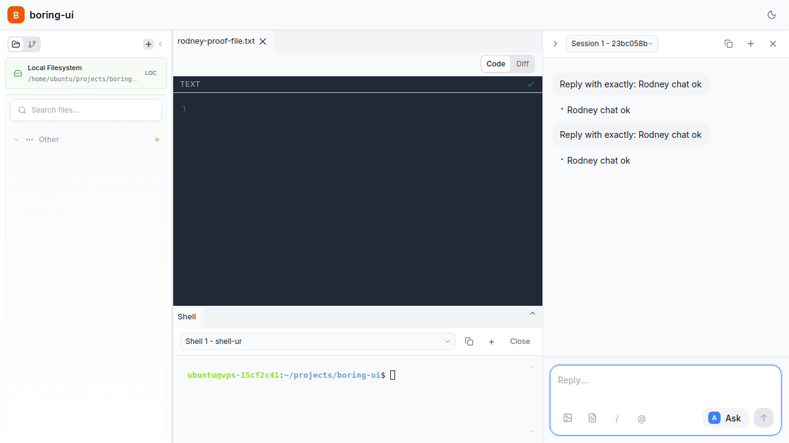

# Hosted Mode UI Proof (Showboat + Rodney)

*2026-02-11T15:01:50Z*

Reference workflow: https://simonwillison.net/2026/Feb/10/showboat-and-rodney/

Goal: prove the hosted-mode UI is working end-to-end with (1) full layout loaded, (2) file operation via UI, and (3) chat responding to a message.

```bash
lsof -iTCP -sTCP:LISTEN -P -n | rg ':5173|:8000|:2469'
```

```output
node      1905479 ubuntu  19u  IPv4 112364871      0t0  TCP *:5173 (LISTEN)
python3   1928276 ubuntu  13u  IPv4 112418681      0t0  TCP *:2469 (LISTEN)
python3   1928277 ubuntu  13u  IPv4 112416564      0t0  TCP *:8000 (LISTEN)
```

```python3
import urllib.request
for u in ['http://213.32.19.186:5173','http://213.32.19.186:5173/api/capabilities','http://213.32.19.186:8000/health','http://213.32.19.186:2469/internal/health']:
    with urllib.request.urlopen(u, timeout=10) as r:
        print(u, r.status)
```

```output
http://213.32.19.186:5173 200
http://213.32.19.186:5173/api/capabilities 200
http://213.32.19.186:8000/health 200
http://213.32.19.186:2469/internal/health 200
```

```bash
uvx rodney status
```

```output
Browser running (PID 1933937)
Debug URL: ws://127.0.0.1:35955/devtools/browser/09a8f1d6-bc62-4ae0-9c5b-9ccd80d72626
Pages: 1
Active page: 0
Current: boring-ui - Boring UI - http://213.32.19.186:5173/?doc=rodney-proof-file.txt
```

```bash
uvx rodney open http://213.32.19.186:5173 && uvx rodney waitidle && uvx rodney title
```

```output
Kurt Web UI
Network idle
boring-ui - Boring UI
```

```bash {image}
uvx rodney screenshot /home/ubuntu/projects/boring-ui/test-results/rodney-proof-01-full-layout.png
```



```bash
uvx rodney js "(() => { const body=document.body.innerText; return { hasWarning: body.includes('Some features are unavailable'), hasFilesPane: body.includes('Other'), hasCodeSessions: body.includes('Session 1') }; })()"
```

```output
{
  "hasCodeSessions": true,
  "hasFilesPane": true,
  "hasWarning": false
}
```

UI File operation proof: create a new file from the File Tree using the New File button.

```bash
uvx rodney click "button[aria-label='New File']" && uvx rodney clear "input.rename-input" && uvx rodney input "input.rename-input" "rodney-proof-file.txt" && uvx rodney js "(() => { const i=document.querySelector('input.rename-input'); i.dispatchEvent(new KeyboardEvent('keydown',{key:'Enter',code:'Enter',which:13,keyCode:13,bubbles:true})); i.dispatchEvent(new KeyboardEvent('keyup',{key:'Enter',code:'Enter',which:13,keyCode:13,bubbles:true})); i.blur(); return 'submitted'; })()" && uvx rodney sleep 2
```

```output
Clicked
Cleared
Typed: rodney-proof-file.txt
submitted
```

```bash {image}
uvx rodney screenshot /home/ubuntu/projects/boring-ui/test-results/rodney-proof-02-file-created.png
```


```python3
from pathlib import Path
p=Path('/home/ubuntu/projects/boring-ui/rodney-proof-file.txt')
print('exists', p.exists())
print('size', p.stat().st_size if p.exists() else -1)
```

```output
exists True
size 0
```

UI Chat proof: send a message and verify assistant response appears in the session.

```bash
uvx rodney clear "textarea[placeholder='Reply...']" && uvx rodney input "textarea[placeholder='Reply...']" "Reply with exactly: Rodney chat ok" && uvx rodney js "(() => { const btn=[...document.querySelectorAll('button')].find(b => (b.textContent||'').trim()==='↑'); if(!btn) return 'no send'; btn.click(); return 'clicked'; })()" && uvx rodney sleep 12
```

```output
Cleared
Typed: Reply with exactly: Rodney chat ok
clicked
```

```bash {image}
uvx rodney screenshot /home/ubuntu/projects/boring-ui/test-results/rodney-proof-03-chat-response.png
```



```bash
uvx rodney js "(() => { const txt=document.body.innerText; return { hasPrompt: txt.includes('Reply with exactly: Rodney chat ok'), hasAssistantResponse: txt.includes('Rodney chat ok') }; })()"
```

```output
{
  "hasAssistantResponse": true,
  "hasPrompt": true
}
```

Conclusion: hosted UI loads full layout, file creation works from UI, and chat returns a response.
