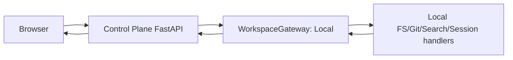
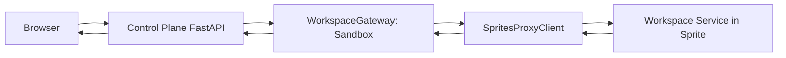
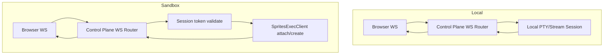
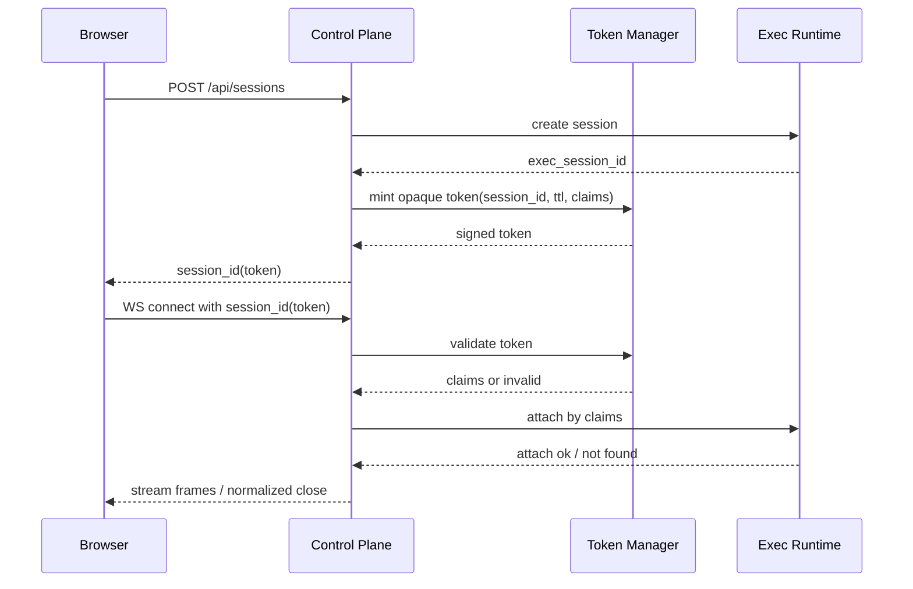
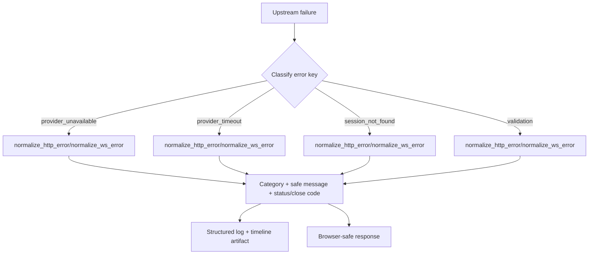

# V0 Local vs Sandbox Data-Flow and Failure-Path Diagrams

This document captures request and websocket behavior for V0 sandbox mode.

## Scope

- HTTP request flow in `local` mode and `sandbox` mode
- WebSocket flow for PTY/chat in `local` mode and `sandbox` mode
- Session token lifecycle for sandbox websocket attach/re-attach
- Failure normalization path from upstream errors to browser-safe responses

## 1) HTTP Data Flow: Local Mode

Notes:
- No proxy hop; handlers execute against local workspace root.
- Browser contract remains `/api/*`.

## 2) HTTP Data Flow: Sandbox Mode

Notes:
- Control plane keeps route shapes stable while dispatching to sprite runtime.
- Guardrails and internal auth are applied before upstream delegation.

## 3) WebSocket Data Flow: PTY/Chat

Notes:
- In sandbox mode, browser sees opaque `session_id`; internal exec identity stays server-side.
- Re-attach behavior is bounded by lifecycle policy windows.

## 4) Sandbox Session Token Lifecycle

## 5) Failure Normalization Path

Notes:
- Internal details are not leaked to browser responses.
- Timelines/artifacts retain enough context for fault replay and debugging.

## 6) Failure-Path Matrix (Quick Reference)

| Failure class | HTTP status | WS close | Normalized category | Browser impact |
|---|---:|---:|---|---|
| Provider unavailable | 503 | 4006 | `provider_unavailable` | Retry/backoff path |
| Provider timeout | 504 | 4007 | `provider_timeout` | Timeout UX + retry |
| Session not found | 404 | 4001 | `not_found` | Reconnect fails deterministically |
| Session terminated | 410 | 4002 | `not_found` | New session required |
| Validation error | 400 | 4003/4004 | `validation` | Client-side correction |

## 7) Operator Use

Use these diagrams when:
- triaging parity regressions between local and sandbox mode
- explaining token and re-attach behavior during incidents
- validating whether failures were normalized at the control-plane boundary
