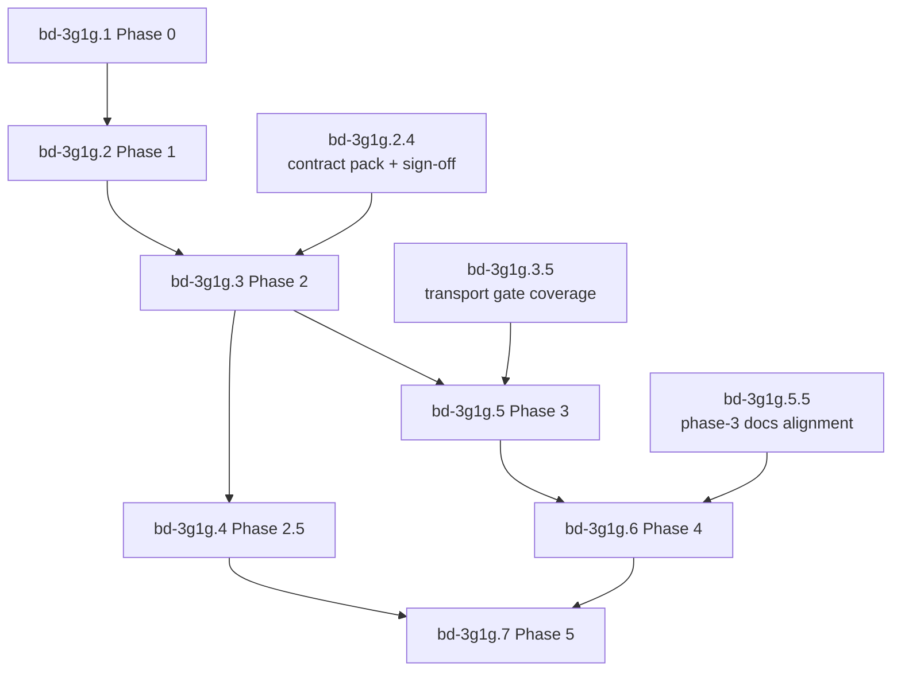

# bd-3g1g.1.3 Phase-Gate Dependency Graph

Bead: `bd-3g1g.1.3`  
Scope: encode phase entry/exit gates as explicit bead dependencies and publish the critical path.

## Gate Edges Added In This Bead

1. `bd-3g1g.3` now `blocks` on `bd-3g1g.2.4` (Phase 1 contract pack/sign-off gate).
2. `bd-3g1g.5` now `blocks` on `bd-3g1g.3.5` (Phase 2 transport gate completion).
3. `bd-3g1g.6` now `blocks` on `bd-3g1g.5.5` (Phase 3 documentation alignment gate).

These convert implicit phase-exit expectations into explicit tracker-enforced prerequisites.

## Phase-Level Dependency Graph

## Critical Path (Tracker-Enforced)

1. `bd-3g1g.1.1` -> `bd-3g1g.1.2` -> `bd-3g1g.1.3` -> `bd-3g1g.1.4`
2. `bd-3g1g.2.1` -> `bd-3g1g.2.2` -> `bd-3g1g.2.3` -> `bd-3g1g.2.4`
3. `bd-3g1g.3.1` -> `bd-3g1g.3.2` -> `bd-3g1g.3.3` -> `bd-3g1g.3.4` -> `bd-3g1g.3.5`
4. `bd-3g1g.5.1` + `bd-3g1g.5.2` -> `bd-3g1g.5.4` -> `bd-3g1g.5.5`
5. `bd-3g1g.6.1` + `bd-3g1g.6.2` + `bd-3g1g.6.3` -> `bd-3g1g.6.4` -> `bd-3g1g.6.5`
6. `bd-3g1g.7.1` + `bd-3g1g.7.5` -> `bd-3g1g.7.2` -> `bd-3g1g.7.3` -> `bd-3g1g.7.4`

## Gate Representation Checklist

1. No phase starts without prior phase gate dependencies represented.
2. Gate-heavy sub-beads (`2.4`, `3.5`, `5.5`) are now explicit prerequisites for downstream phases.
3. Phase-5 verification chain (`7.5` -> `7.2` -> `7.3` -> `7.4`) remains explicit and auditable.
